**The Acclaim source code currently distributed is almost completely contained in the `kernel` directory. The execptions are some small changes in the kernel's memory management system. More details are listed in the following.**

## Foreground aware eviction (FAE)

To recognize the owner of a page, we add a UID for each page. And then, acclaim lowers the priority of pages that belong to background apps in LRU lists when they are needed to be removed. There are three steps.

**STEP 1:** In this version, we modify page struct to add uid (`uid_lenny`) in file `/include/linux/mm_type.h`.

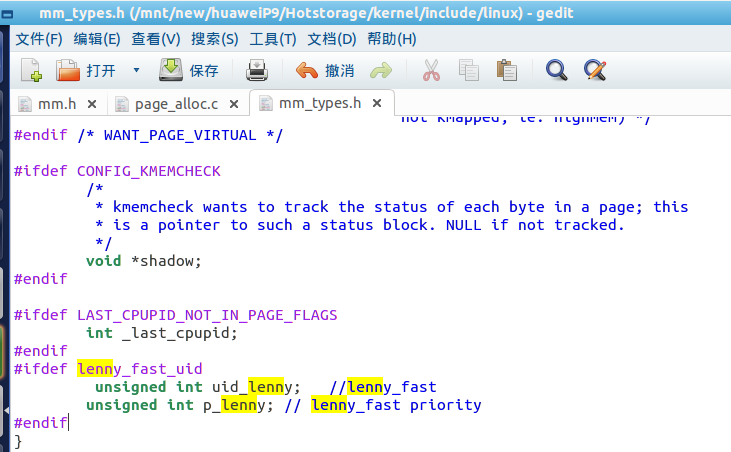

**STEP 2:** init uid and priority in function `__alloc_pages_nodemask` in file `/mm/page_alloc.c`

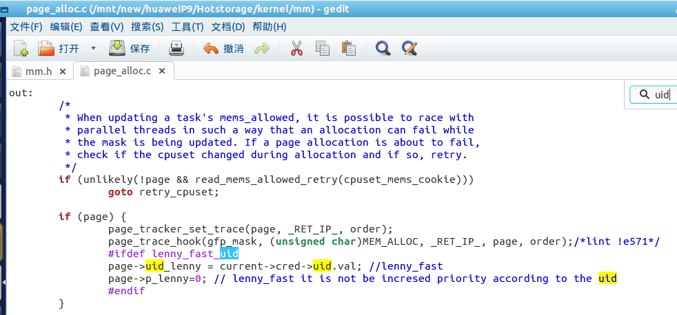

**STEP 3:** Acclaim changes the priority of pages that belong to background apps in LRU lists when they are needed to be removed.

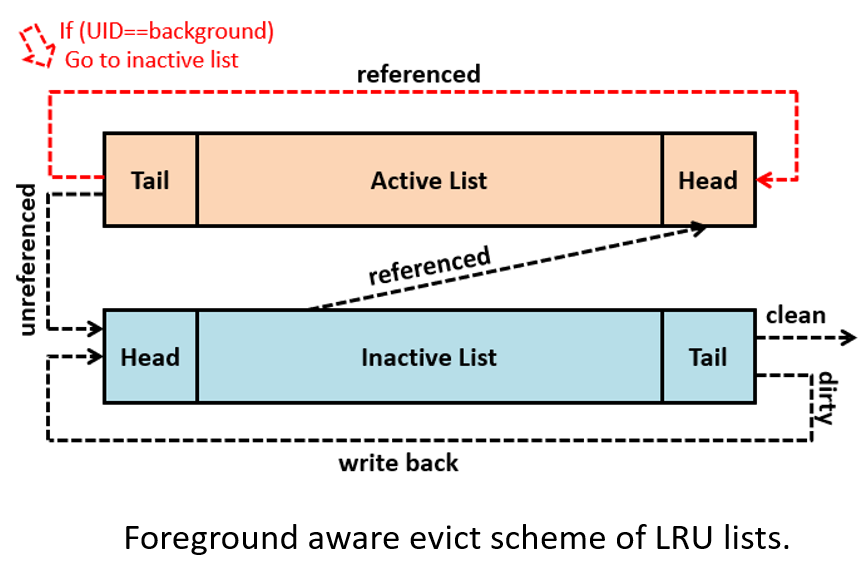

In function `shrink_active_list()` in file `/mm/vmscan.c`, if a page is referenced in active list, if it is not a background page, it will be moved to the head of active list as normal. However, if it is a background page, it will be move to the head inactive list.

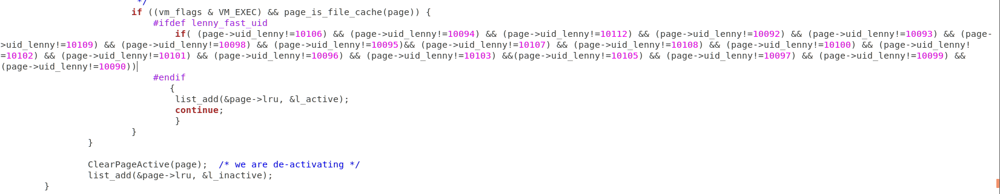

All these data are the background uids.

In this version, we fixed the background uid in code, if you want change background apps, please check the following.

We can know the uid of apps by using adb shell command.

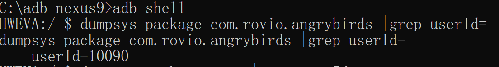
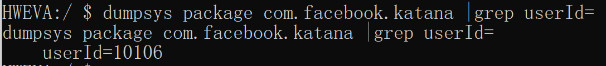
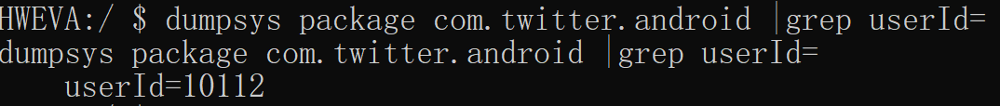
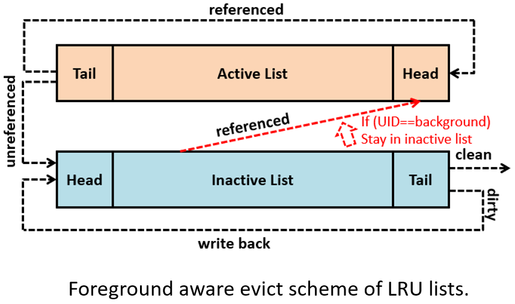

In function `shrink_active_list()` in file `/mm/vmscan.c`. if a page is referenced in inactive list, if it is not a background page, it will be moved to the head of active list as normal. However, if it is a background page, it will be stay in inactive list.

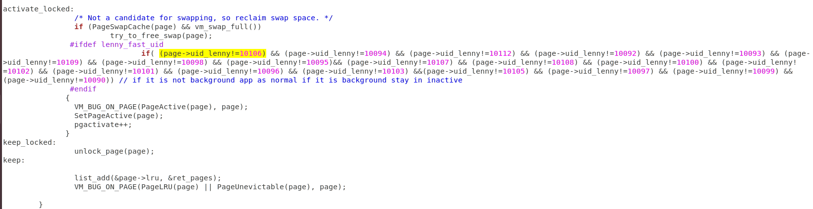

## Lightweight prediction-based reclaim scheme (LWP)

A lock-free sliding window is predicted in in `mm/page_alloc.c` In function `__alloc_pages_nodemask()`. In this version, the `sliding==window`.

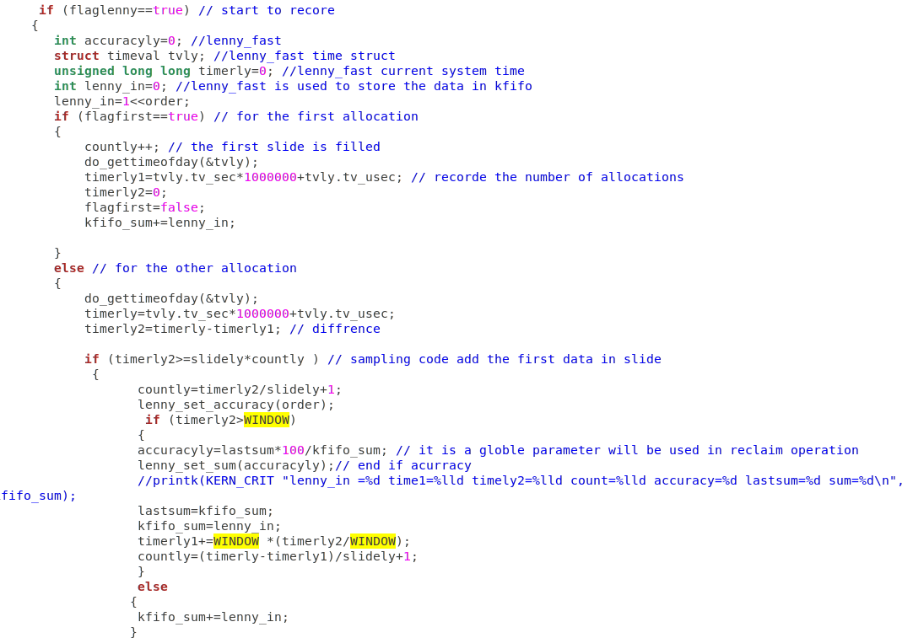

We get the trend of sum and the average.

According to the predicted results, acclaim tunes the amount of kswap. In function `kswapd_shrink_zone`. In `/mm/vmscan.c`.

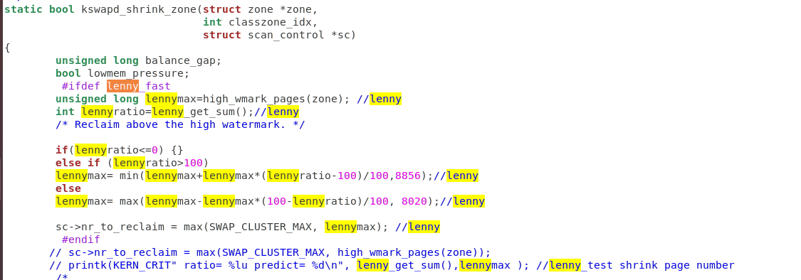

Acclaim tunes the size of each reclaim in function `weakup_kswap()` in `mm/vmscan.c`.

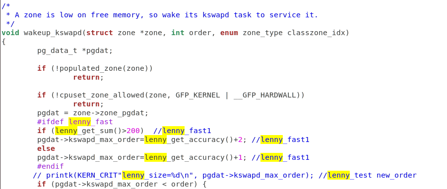

## Check re-fault and evict information

We print evict and refault and then count them by using adb shell `cat`.

Eviction information is printed in function `workingset_eviction()` in file `workingset.c`.

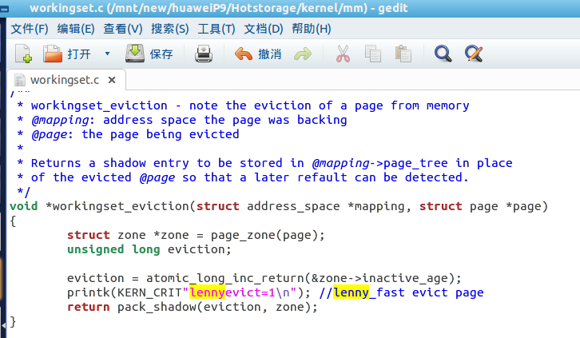

Refault information is printed in function `workingset_refault()` in `workingset.c`.

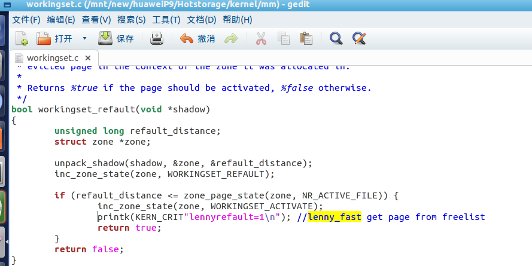

